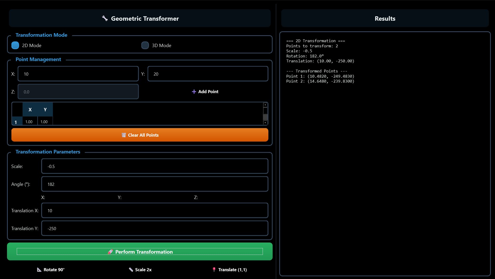

# Geometric Transformer

A Python project demonstrating 2D and 3D geometric transformations, including translation, scaling, Euclidean, similarity, affine, and projective transformations. The project also covers rotations using Rodrigues matrices, quaternions, and exponential twists.

---

## Features

### 2D Transformations
- Translation
- Scaling
- Euclidean (rigid) transformations
- Similarity transformations
- Affine transformations
- Projective transformations

### 3D Transformations
- 3D Translation and Scaling
- Euclidean and Similarity transformations
- Affine and Projective transformations
- Rotations using:
  - Rodrigues rotation formula
  - Quaternions
  - Exponential twist (matrix exponential)
